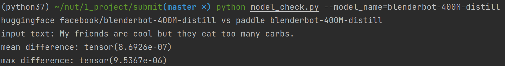
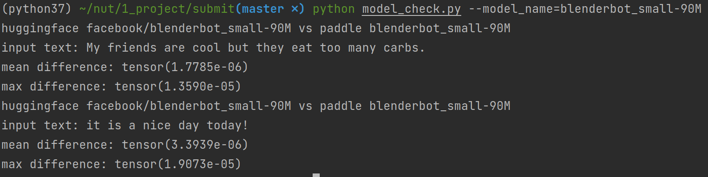
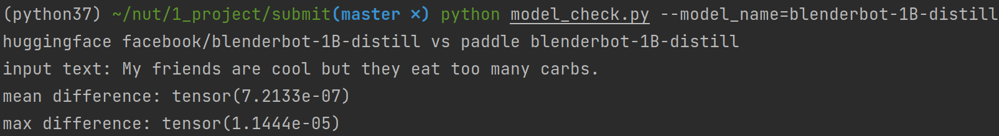

# Blenderbot

English | [简体中文](README_cn.md)

* [Blenderbot](#blenderbot)
   * [1.Introduction](#1introduction)
   * [2. Requirments](#2-requirments)
   * [3. Example](#3-example)
   * [4. Code and reproduce details](#4-code-and-reproduce-details)
      * [4.1 Code overview](#41-code-overview)
   * [4.2 Convert model weight](#42-convert-model-weight)
   * [4.3 Model Verify](#43-model-verify)
      * [Verify Tokenizer](#verify-tokenizer)
      * [Verify Model Forward Consistency](#verify-model-forward-consistency)
   * [4.4 Others](#44-others)
   * [5.Model Information](#5model-information)

## 1.Introduction

Open-domain chatbots is a challenging in Machine Learning/ Deep Learning fields. The experiment in [Recipes for building an open-domain chatbot](https://aclanthology.org/2021.eacl-main.24.pdf) shows that chatbot is able to emphasize key points, maintaining a consistent persona under appropriate training and generating methods. 

Blenderbot Generator applied traditional Seq2Seq Transformer architecture, this repository reproduced **Blenderbot** (referred to model with 2.7B parameters) and **BlenderbotSmall** (referred to model with 90M parameters) in  [Recipes for building an open-domain chatbot](https://aclanthology.org/2021.eacl-main.24.pdf) using PaddlePaddle.

## 2. **Requirements**

This repo use `python==3.7` and `paddlepaddle==2.1.2`, both model forward test and weight converting are done in CPU mode.

**Install paddle and paddlenlp relevant requirements.**

```shell
pip install -r requirements.txt
python -m pip install paddlepaddle -i https://mirror.baidu.com/pypi/simple
```

To conduct weight converting and forward test, torch and transformers are needed:

```shell
torch==1.7.1
transformers==4.9.1
```

useful links:

```shell
pip install torch==1.7.1+cpu torchvision==0.8.2+cpu torchaudio==0.7.2 -f https://download.pytorch.org/whl/torch_stable.html
```

## 3. Example

For BlenderbotSmall:

```python
from paddlenlp.transformers import BlenderbotSmallTokenizer,BlenderbotSmallForConditionalGeneration
model_name = "blenderbot_small-90M"

# load pretrained model
tokneizer = BlenderbotSmallTokenizer.from_pretrained(model_name)
model = BlenderbotSmallForConditionalGeneration.from_pretrained(model_name)

text = "it is a nice day today!" 
inputs = tokenizer(text)
input_tensor = paddle.to_tensor([inputs["input_ids"]])

logits = model(input_tensor)
```

For Blenderbot:

```python
from paddlenlp.transformers import BlenderbotTokenizer,BlenderbotForConditionalGeneration
model_name = "blenderbot-400M-distill"

tokneizer = BlenderbotTokenizer.from_pretrained(model_name)
model = BlenderbotForConditionalGeneration.from_pretrained(model_name)

text = "it is a nice day today!" 
inputs = tokenizer(text)
input_tensor = paddle.to_tensor([inputs["input_ids"]])

logits = model(input_tensor)
```

other model_name options:  `blenderbot-1B-distill`,  `blenderbot-3B`. 

## 4. Code and reproduce details

### 4.1 Code overview

```c
.
├── data
│   └── blenderbot_small-90M        //pretrain weight and vocab store path
├── paddlenlp                       //paddlenlp library
│   └── transformers
│       ├── blenderbot              //blenderbot - referred to 2.7B model
│       │   ├── modeling.py         //model
│       │   └── tokenizer.py        //blenderbot tokenizer
│       └── blenderbot_small        //blenderbot_small - referred to 90Mmodel
│           ├── modeling.py
│           └── tokenizer.py
├── img                             //Readme image path
├── README.md                       //Readme in English
├── README_cn.md                    //Readme in Chinese
├── requirements.txt                //paddlenlp relevant requirements
├── model_check.py                  //forward accuracy check
├── convert.py                      //file for convert weight
└── tokenizer_check.py              //tokenizer consistency check
```

## 4.2 Convert model weight

Convert pretrained model weight from  [Hugging Face](https://huggingface.co/models?search=blender), the model to convert is [blenderbot_small-90M](https://huggingface.co/facebook/blenderbot_small-90M/tree/main), [blenderbot-400M-distill](https://huggingface.co/facebook/blenderbot-400M-distill/tree/main), [blenderbot-1B-distill](https://huggingface.co/facebook/blenderbot-1B-distill/tree/main), and [blenderbot-3B](https://huggingface.co/facebook/blenderbot-3B/tree/main). Please download the corresponding pretrained weight before convert them.

Convert model weight for `blenderbot-400M-distill` :

```
python convert.py --model_name=blenderbot-400M-distill --torch_file_folder=../../../Download
```

**Notes:**

+ `--model_name` should be selected from：`blenderbot-400M-distill, blenderbot_small-90M, blenderbot-1B-distill, blenderbot-3B`.
+ The code will load hugging face weight from  `--torch_file_folder/model_name/pytorch_model.bin`.  For instance, the loading path of above sample code is `../../../Download/blenderbot-400M-distill/pytorch_model.bin` . The default output path is `./data/blenderbot-400M-distill/model_state.pdparams`
+ For hugging face, `blenderbot-400M-distill`  and `blenderbot_small-90M` use float32 as the default dtype, while `blenderbot-1B-distill` , `blenderbot-3B` use float16. You might pass  `--dtype` parameter (default as float32) to modify the output dtype, for example:

```shell
python convert.py --model_name=blenderbot-3B --torch_file_folder=../../../Download --dtype=float16
```

links for converted paddle weight: 

Baidu Drive: https://pan.baidu.com/s/1MGHSE4Q_mXEMuYT3CwzJiA  Password: lgl5

## 4.3 Model Verify

### Verify Tokenizer

Verify Blenderbotsmall tokenizer

```
python tokenizer_check.py --model_name=blenderbot_small-90M
```

> input text: My friends are cool but they eat too many carbs.
>
> torch tokenizer:  [42, 643, 46, 1430, 45, 52, 1176, 146, 177, 753, 2430, 5]
>
> paddle tokenizer:  [42, 643, 46, 1430, 45, 52, 1176, 146, 177, 753, 2430, 5]

Verify Blenderbot tokenizer

```
python tokenizer_check.py --model_name=blenderbot-400M-distill
```

> input text: My friends are cool but they eat too many carbs.
>
> torch tokenizer:  [863, 1329, 366, 1449, 373, 382, 1861, 618, 847, 911, 1372, 21, 2]
>
> paddle tokenizer:  [863, 1329, 366, 1449, 373, 382, 1861, 618, 847, 911, 1372, 21, 2]

### Verify Model Forward Propagation Consistency

Since the dtype of  `blenderbot-400M-distill` and `blenderbot_small-90M` is `float32`, to conduct the following test, please convert the corresponding weight with dtype `float32`.

Verify  `blenderbot-400M-distill` 

```
python model_check.py --model_name=blenderbot-400M-distill
```



Verify  `blenderbot_small-90M` 

```
python model_check.py --model_name=blenderbot_small-90M
```



Verify `blenderbot-1B-distill`



## 4.4 Others

**Blenderbot Vs. BlenderbotSmall**

| Parameters in Hugging face config file | BlenderbotSmall (Value) | Blenderbot (Value) |
| -------------------------------------- | ----------------------- | ------------------ |
| Normalize_before                       | False                   | True               |
| add_final_layer_norm                   | False                   | True               |
| normalize_embedding                    | True                    | False              |

+ `normalize_before` refers to `normalize_before` parameter in  `nn.TransformerEncoderLayer` .
+ When`normalize_embedding` is True, in encoder and decoder, the layer norm will be applied on `input_embeds` . Please referred to line 241 in `paddlenlp/transformers/blenderbot_small/modeling.py` for detail.
+ When `add_final_layer_norm` is True, in encoder and decoder, layer norm will be applied on encoder_output and decoder_output. Please referred to line 222 in `paddlenlp/transformers/blenderbot/modeling.py` for detail.

**Some parameters about generating the prediction result is not configured in this repo:**

```python
{"length_penalty": 0.65,
  "max_length": 60,
  "min_length": 20,
  "num_beams": 10,
  "force_bos_token_to_be_generated": false,
  "forced_eos_token_id": 2,}
```

Other parameters, which are not configured in this repo:

```python
{
  "classif_dropout": 0.0,
  "decoder_layerdrop": 0.0,
  "encoder_layerdrop": 0.0,
  "do_blenderbot_90_layernorm": true, 
  "static_position_embeddings": false,
  "use_cache": true,
  "num_hidden_layers": 2,
  "layernorm_variant": "prelayernorm",
  "is_encoder_decoder": true,
  "encoder_no_repeat_ngram_size": 3,
}
```

For `do_lenderbot_90_layernorm` , which is mentioned in transformers [configuration](https://huggingface.co/transformers/v3.4.0/_modules/transformers/configuration_blenderbot.html),  no related settings was found in `transformers.model.blenderbot` source code. You might refer to some [discussions](https://gist.github.com/sshleifer/cb245b8739420724a32fc0c22344aee0) about this parameter. 

The value for `decoder_layerdrop` and `encoder_layerdrop` are both 0, which is consistent with  `TransformersDecoder`/ `TransformersEncoder`  in paddlenlp.

## 5.Model Information

| Information Name     | Description                                                  |
| -------------------- | ------------------------------------------------------------ |
| Announcer            | kevin Wu                                                     |
| Time                 | 2021.08                                                      |
| Framework Version    | Paddle 2.1.2                                                 |
| Application Scenario | NLP/ Dialogue                                                |
| Supported Hardwares  | GPU、CPU                                                     |
| Download Links       | [pretrained model weight Baidu Drive](https://pan.baidu.com/s/1MGHSE4Q_mXEMuYT3CwzJiA)  Password: lgl5 |

