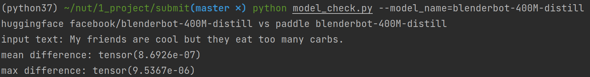

# Blenderbot

* [Blenderbot](#blenderbot)
   * [1.简介](#1简介)
   * [2.环境依赖](#2环境依赖)
   * [3.模型示例](#3模型示例)
   * [4.代码结构与详细复现说明](#4代码结构与详细复现说明)
      * [4.1 代码结构](#41-代码结构)
      * [4.2 权重转换](#42-权重转换)
      * [4.3 模型核对](#43-模型核对)
         * [<strong>Tokenizer 核对</strong>](#tokenizer-核对)
         * [前向传导精度校验](#前向传导精度校验)
      * [4.4 其他](#44-其他)
         * [模型对比 Blenderbot Vs. BlenderbotSmall](#模型对比-blenderbot-vs-blenderbotsmall)
         * [其他相关配置](#其他相关配置)
   * [5.模型信息](#5模型信息)

## 1.简介

开放式的聊天系统一直是机械学习/深度学习领域的一个巨大挑战。[Recipes for building an open-domain chatbot](https://aclanthology.org/2021.eacl-main.24.pdf) 一文展示了大规模模型在对训练数据和对话生成方式进行合理选择后，可以在对话中做到强调重点，保持对话个性与聊天基调等。

Blenderbot Generator 采用了传统的 Seq2Seq Transformer 架构，本仓库用 Paddle 复现了 [Recipes for building an open-domain chatbot](https://aclanthology.org/2021.eacl-main.24.pdf) 论文中的 Blenderbot（对应论文中2.7B模型 ） 与 Blenderbot small （对应论文中90M模型）。

**项目 aistudio 地址：**

[aistudio - blenderbot](https://aistudio.baidu.com/aistudio/projectdetail/2259520?shared=1)

## 2.环境依赖

本次复现使用的python版本为3.7，paddlepaddle 框架版本为 2.1.2，模型权重转换与前向传导均在 CPU 环境下完成。

安装 paddle 与 paddlenlp 需要的相关依赖：

```shell
pip install -r requirements.txt
python -m pip install paddlepaddle -i https://mirror.baidu.com/pypi/simple
```

若要进行权重转换及模型前向传导测试，除了 paddle 相关的依赖之外还需安装 torch 与 transformers，版本如下：

```shell
torch==1.7.1
transformers==4.9.1
```

相关链接：

```
pip install torch==1.7.1+cpu torchvision==0.8.2+cpu torchaudio==0.7.2 -f https://download.pytorch.org/whl/torch_stable.html
```

## 3.模型示例

```python
from paddlenlp.transformers import BlenderbotSmallTokenizer,BlenderbotSmallForConditionalGeneration
model_name = "blenderbot_small-90M"

# load pretrained model
tokneizer = BlenderbotSmallTokenizer.from_pretrained(model_name)
model = BlenderbotSmallForConditionalGeneration.from_pretrained(model_name)

text = "it is a nice day today!" 
inputs = tokenizer(text)
input_tensor = paddle.to_tensor([inputs["input_ids"]])

logits = model(input_tensor)
```

对于 Blenderbot 模型，需要将模型导入部分更换为：

```python
from paddlenlp.transformers import BlenderbotTokenizer,BlenderbotForConditionalGeneration
model_name = "blenderbot-400M-distill"

tokneizer = BlenderbotTokenizer.from_pretrained(model_name)
model = BlenderbotForConditionalGeneration.from_pretrained(model_name)
```

Blenderbot 可选择加载 `blenderbot-400M-distill`、 `blenderbot-1B-distill` 或  `blenderbot-3B`预训练权重。

## 4.代码结构与详细复现说明

### 4.1 代码结构

```C
.
├── data
│   └── blenderbot_small-90M        //模型预训练权重与词表储存路径
├── paddlenlp                       //paddlenlp库（仅展示相关模型代码）
│   └── transformers
│       ├── blenderbot              //blenderbot - 对应论文中2.7B模型
│       │   ├── modeling.py         //模型相关函数
│       │   └── tokenizer.py        //blenderbot tokenizer相关函数
│       └── blenderbot_small        //blenderbot_small - 对应论文中90M模型
│           ├── modeling.py
│           └── tokenizer.py
├── img                             //Readme文件图片储存路径
├── README.md                       //英文文档
├── README_cn.md                    //中文文档
├── requirements.txt                //paddlenlp相关Python依赖
├── model_check.py                  //模型前向传导精度检验文件
├── convert.py                      //权重转换文件
└── tokenizer_check.py              //tokenizer一致性检验
```

### 4.2 权重转换

使用 `convert.py` 文件将 [Hugging Face](https://huggingface.co/models?search=blender) 上的 blenderbot-400M-distill, blenderbot_small-90M, blenderbot-1B-distill, blenderbot-3B 四个模型预训练权重进行转换。转换前需要将hugging face的模型权重下载到对应的目录下。以下提供上述权重的 hugging face 下载链接：

[blenderbot_small-90M](https://huggingface.co/facebook/blenderbot_small-90M/tree/main)，[blenderbot-400M-distill](https://huggingface.co/facebook/blenderbot-400M-distill/tree/main)，[blenderbot-1B-distill](https://huggingface.co/facebook/blenderbot-1B-distill/tree/main)，[blenderbot-3B](https://huggingface.co/facebook/blenderbot-3B/tree/main)

**模型权重转换：**

```shell
python convert.py --model_name=blenderbot-400M-distill --torch_file_folder=../../../下载
```

**注意：**

+ `--model_name` 参数应该与 hugging face 上的模型权重名称一致，即：`blenderbot-400M-distill, blenderbot_small-90M, blenderbot-1B-distill, blenderbot-3B`

+ 程序会从 `--torch_file_folder/model_name/pytorch_model.bin` 加载torch 权重，以上面代码为例，加载路径为 `../../../下载/blenderbot-400M-distill/pytorch_model.bin` 默认输出路径为 `./data/blenderbot-400M-distill/model_state.pdparams`

+ hugging face上 `blenderbot-400M-distill`  与`blenderbot_small-90M` 的权重采用的是float32，而 `blenderbot-1B-distill` , `blenderbot-3B` 采用的是 float16， 转换时候可以提供 `--dtype` 参数（默认float32）来控制保存的格式，如：

```shell
python convert.py --model_name=blenderbot-3B --torch_file_folder=../../../下载 --dtype=float16
```

转换后的 **paddle 权重下载** 链接 （float16的权重在文件夹末尾会注明float16）：

百度网盘链接: https://pan.baidu.com/s/1MGHSE4Q_mXEMuYT3CwzJiA  密码: lgl5

由于  `blenderbot-3B`  预训练权重较大，因此只转换并上传了 float16 的版本。

### 4.3 模型核对

#### **Tokenizer 核对**

本仓库实现了 tokenizer与 hugging face 的对齐，因 BlenderbotSmall 与 Blenderbot 的 tokenize 方式有所不同，如采用的 BPE 细节等。因此并没有将他们合并成一个tokenizer。

核对 blenderbotsmall 的tokenizer

```
python tokenizer_check.py --model_name=blenderbot_small-90M
```

> input text: My friends are cool but they eat too many carbs.
>
> torch tokenizer:  [42, 643, 46, 1430, 45, 52, 1176, 146, 177, 753, 2430, 5]
>
> paddle tokenizer:  [42, 643, 46, 1430, 45, 52, 1176, 146, 177, 753, 2430, 5]

核对 blenderbot 的 tokenizer

```
python tokenizer_check.py --model_name=blenderbot-400M-distill
```

> input text: My friends are cool but they eat too many carbs.
>
> torch tokenizer:  [863, 1329, 366, 1449, 373, 382, 1861, 618, 847, 911, 1372, 21, 2]
>
> paddle tokenizer:  [863, 1329, 366, 1449, 373, 382, 1861, 618, 847, 911, 1372, 21, 2]

#### 前向传导精度校验

官方要求的 `blenderbot-400M-distill` 与 `blenderbot_small-90M` 模型校验：

因为这两个主要的权重在 hugging face 都为 float32格式，因此本测试代码也使用float32作为默认dtype。所以对于一下测试权重，**在上一步中请使用 float32对他们进行权重转换。**

```shell
python model_check.py --model_name=blenderbot-400M-distill
```



```shell
python model_check.py --model_name=blenderbot_small-90M
```


对 transformers 上给出的例句与随意例句，前向传导后的logits误差都在1E-5级别。

其他两个模型的前向传导检验:

`blenderbot-1B-distill`

```shell
python model_check.py --model_name=blenderbot-1B-distill
```


`blenderbot-3B ` 的权重是在太大了，在个人电脑上跑不动，因此也就没有做前向传导的对比测试了。

### 4.4 其他

#### 模型对比 Blenderbot Vs. BlenderbotSmall

两个模型除了规模差异外，还有以下几点特殊的差别：

| Hugging face 中的 config 参数 | BlenderbotSmall (值) | Blenderbot (值) |
| ----------------------------- | -------------------- | --------------- |
| Normalize_before              | False                | True            |
| add_final_layer_norm          | False                | True            |
| normalize_embedding           | True                 | False           |

+ `normalize_before` 对应 `nn.TransformerEncoderLayer` 的 `normalize_before` 参数
+ `normalize_embedding` 为 True 时， encoder 与 decoder 在执行完 token 到 embedding 的转换后，会对`input_embeds` 进行 layer norm。可参考 `paddlenlp/transformers/blenderbot_small/modeling.py` 中的241行左右。
+ `add_final_layer_norm` 为True时，在 encoder 与 decoder 中，会对encoder_output与decoder_output 进行 layer norm。具体可参考 `paddlenlp/transformers/blenderbot/modeling.py` 222行左右代码。

#### 其他相关配置

**hugging face config 文件中，生成文本的参数没有加载进来，如：**

```python
{"length_penalty": 0.65,
  "max_length": 60,
  "min_length": 20,
  "num_beams": 10,
  "force_bos_token_to_be_generated": false,
  "forced_eos_token_id": 2,}
```

以下这些 config 文件中的参数没有在 paddle 中设置：

```python
{
  "classif_dropout": 0.0,
  "decoder_layerdrop": 0.0,
  "encoder_layerdrop": 0.0,
  "do_blenderbot_90_layernorm": true, 
  "static_position_embeddings": false,
  "use_cache": true,
  "num_hidden_layers": 2,
  "layernorm_variant": "prelayernorm",
  "is_encoder_decoder": true,
  "encoder_no_repeat_ngram_size": 3,
}
```

对于： `do_lenderbot_90_layernorm` 一项，在transformers 的 [configuration文件](https://huggingface.co/transformers/v3.4.0/_modules/transformers/configuration_blenderbot.html) 中有提及，但在 transformers.model.blenderbot 中并没有找到相关应用。 部分网友有对这个参数进行[描述](https://gist.github.com/sshleifer/cb245b8739420724a32fc0c22344aee0) 但并没有在transformers中对应上，不知道是不是版本问题导致的。

Blenderbot与BlenderbotSmall在Transformers 中的 `use_cache` 参数为 True。与 paddlenlp 调用 .generate() 时的默认 `use_cache` 参数值一致。

decoder_layerdrop，encoder_layerdrop 两个模型均为0，因为 paddle 中的  `TransformersDecoder`/ `TransformersEncoder` 似乎没有layer drop的设置,（不太确定，因为个人没找到相关layer drop的设置）所以此时不传递这个参数并没有影响。

`classif_dropout` 在  transformers.model.blenderbot中也是没有找到相关的应用

## 5.模型信息

关于模型的其他信息，可以参考下表：

| 信息     | 说明                                                         |
| -------- | ------------------------------------------------------------ |
| 发布者   | kevin吴嘉文                                                  |
| 时间     | 2021.08                                                      |
| 框架版本 | Paddle 2.1.2                                                 |
| 应用场景 | 自然语言处理/对话生成                                        |
| 支持硬件 | GPU、CPU                                                     |
| 下载链接 | [预训练权重 百度网盘链接](https://pan.baidu.com/s/1MGHSE4Q_mXEMuYT3CwzJiA)  密码: lgl5 |

